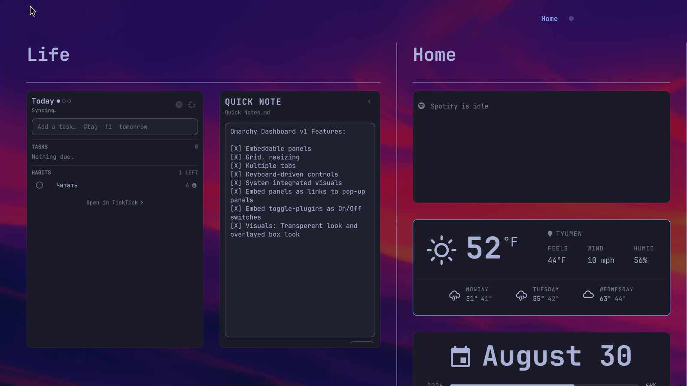
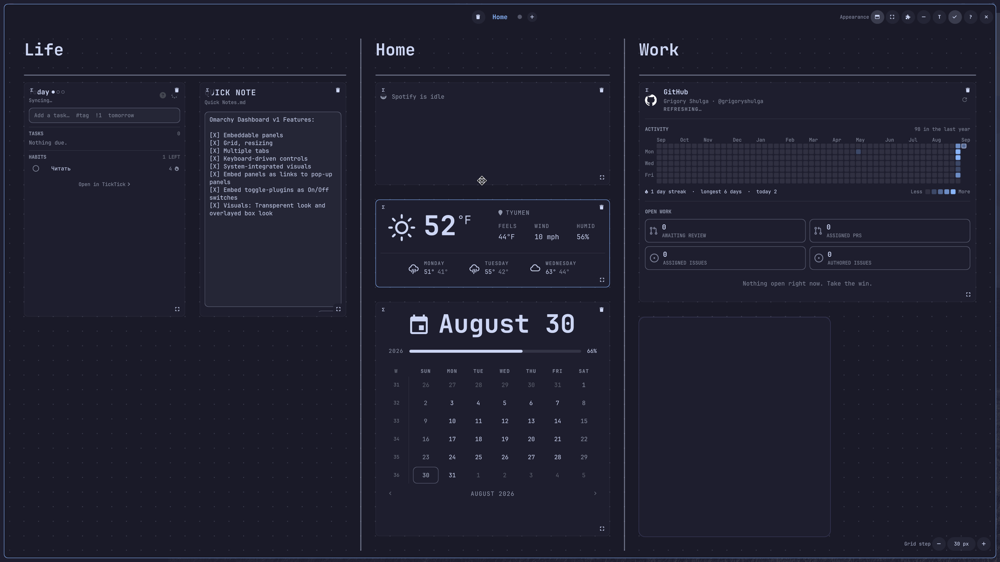
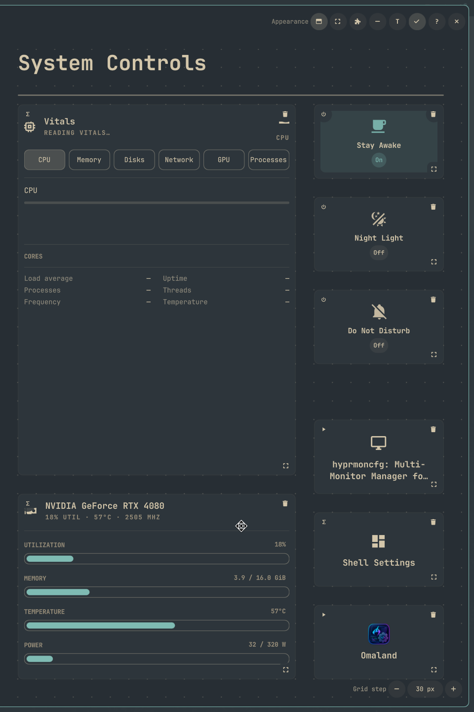

# Omarchy Dashboard

Omarchy Dashboard turns your Omarchy Shell plugins into one keyboard-first
workspace. Arrange plugin pages, widgets, system controls, and launchers as
resizable tiles on a snap-to-grid canvas; organize them into named Spaces; and
switch between browsing, interacting, and editing without leaving the
Dashboard. Choose a focused Framed surface or a transparent Glass view that
follows your theme and Hyprland blur settings. The built-in catalog and CLI make
adding, placing, and automating plugins straightforward.



## Features

- a free-form pixel grid with a configurable 5–80 px step, drag and drop,
  resizing, and collision prevention;
- decorative grid overlays: horizontal and vertical dividers between grid points
  plus text labels with automatically scaled fonts;
- multiple named Spaces with a compact switcher and inline renaming;
- `browse`, `interact`, and `edit` modes with predictable focus ownership;
- opening on the monitor that invoked the launcher, or on the focused monitor;
- a catalog of installed system and user plugins;
- universal tiles: embedded pages, compact `dashboardWidget`s, service controls,
  Dashboard popouts, or native/information fallbacks;
- two surface modes: classic `Framed` and fullscreen `Glass`;
- compositor-owned Glass blur that exactly follows Hyprland's live blur settings;
- theme, dimensions, spacing, and corner radii from the current Omarchy Shell;
  corner radii update after a Hyprland config reload without restarting the shell;
- bounded, validated state in the XDG state directory.

## Screenshots

### Glass: a focused daily workspace

The `Glass` surface blends the current Omarchy wallpaper into the canvas while
keeping every plugin tile legible. This example uses the Tokyo Night theme.


### Framed: edit the grid directly

`Framed` adds a distinct, opaque working surface. In `edit` mode, the visible
dot grid, selection state, tile handles, and the grid-step control make the
layout easy to refine precisely.



### A separate Space for system controls

Spaces can be dedicated to a specific context. This cropped second Space uses
the Everforest theme and combines embedded system panels, dashboard-owned
controls, and launcher tiles.



## Installation

From the Git repository:

```bash
omarchy plugin add https://github.com/grigoryshulga/omarchy-dashboard.git --enable
```

If the launcher was not added automatically:

```bash
omarchy plugin enable gshulga.dashboard --section left
```

For local development, copy the repository contents to
`~/.config/omarchy/plugins/gshulga.dashboard`, then run:

```bash
omarchy plugin validate ~/.config/omarchy/plugins/gshulga.dashboard
omarchy plugin enable gshulga.dashboard --section left
omarchy restart shell
```

Open the Dashboard with its bar button or this command:

```bash
omarchy-shell shell toggle gshulga.dashboard
```

## Managing plugins from the CLI

After installing Dashboard, its CLI can be added to the user's `PATH`:

```bash
mkdir -p ~/.local/bin
ln -sfn ~/.config/omarchy/plugins/gshulga.dashboard/bin/omarchy-dashboard \
  ~/.local/bin/omarchy-dashboard
```

Installing from Git creates a **Pending Placement** by default: the plugin is
already managed by Dashboard, but does not yet occupy a place in any Space.

```bash
omarchy-dashboard plugin install https://github.com/acme/weather.git
```

The plugin appears first in the catalog with a `Pending placement` label. Open
Dashboard, press `Alt+E`, then `Alt++`, select the plugin, and place it using
the normal preview silhouette.

An installed plugin can also be sent to pending placement:

```bash
omarchy-dashboard plugin add acme.weather
```

When the Space and geometry are known in advance, create a **Placed Tile**
directly. `Rect` uses logical QML pixels in the form `X,Y,W,H` and is validated
strictly: Dashboard never shifts or shrinks it when it collides.

```bash
omarchy-dashboard plugin install https://github.com/acme/weather.git \
  --space space-main --rect 0,0,420,300

omarchy-dashboard plugin add acme.weather \
  --space space-main --rect 0,0,420,300
```

Automatic placement is enabled only explicitly:

```bash
omarchy-dashboard plugin add acme.weather --space space-main --auto
```

Full command set:

```bash
omarchy-dashboard space list
omarchy-dashboard space create Work --id space-work
omarchy-dashboard space rename Work Focus
omarchy-dashboard space select Focus
omarchy-dashboard space remove Focus --yes
omarchy-dashboard grid show
omarchy-dashboard grid set 30
omarchy-dashboard element add-text Life --space Home --rect 30,15,660,45 --id home-life-title
omarchy-dashboard element add-divider --space Home --line 30,75,690,75 --id home-life-rule
omarchy-dashboard element list --space Home
omarchy-dashboard element remove home-life-rule
omarchy-dashboard plugin list
omarchy-dashboard plugin list --state pending --json
omarchy-dashboard plugin place acme.weather --space space-main --rect 0,0,420,300
omarchy-dashboard plugin move acme.weather --space space-work --auto
omarchy-dashboard plugin pending acme.weather
omarchy-dashboard plugin remove acme.weather
omarchy-dashboard plugin uninstall acme.weather
omarchy-dashboard plugin uninstall acme.weather --remove-placement --yes
```

The built-in help is designed for both people and agents: top-level `--help`
describes the coordinate model, safe provisioning workflow, JSON contract, and
exit codes; group and command help include semantics and ready-to-run examples.

```bash
omarchy-dashboard --help
omarchy-dashboard plugin --help
omarchy-dashboard plugin add --help
omarchy-dashboard element --help
```

`element` manages Dashboard-owned text and dividers; coordinates use the same
logical canvas pixels as `plugin --rect`. `remove` deletes only the Host
Placement and keeps the Plugin Installation on disk. `uninstall` removes the
code, but refuses while the plugin remains in Dashboard unless
`--remove-placement` is supplied explicitly. Every read and mutation command
supports `--json` for automation.

Example user Hyprland binding:

```ini
bindd = SUPER, D, Dashboard, exec, omarchy-shell shell toggle gshulga.dashboard
```

## Controls

| Keys | Action |
| --- | --- |
| `SUPER+D` | Toggle Dashboard from anywhere |
| `← ↑ ↓ →` / `H J K L` | Select the nearest tile by geometry |
| `Ctrl+Tab` / `Ctrl+Shift+Tab` | Next / previous tile |
| `Enter` | Give the selected plugin focus (`interact`) |
| `Esc` | Leave `interact`, then `edit`, then close Dashboard |
| `Page Up` / `Page Down` | Previous / next Space |
| Three-finger horizontal swipe | Previous / next Space (when the compositor forwards touch points to Dashboard) |
| `Alt+1` … `Alt+9` | Go to a Space by number |
| `Alt++` | Open the plugin catalog in `edit` |
| `Alt+E` | Toggle `edit` |
| `Alt+V` | Toggle `Framed` / `Glass` in `edit` |
| `Alt+arrow keys` / `Alt+H J K L` | Move the selected tile or graphic element in `edit` |
| `Shift+arrow keys` / `Shift+H J K L` | Resize the selected tile or graphic element in `edit` |
| `arrow keys` / `H J K L` (with `Shift` to resize) | Move / resize a new-tile silhouette |
| `Enter` / `Esc` | Place / cancel a new tile |
| `Alt+C` / `Alt+R` | Create / rename a Space |
| `Alt+X` | Delete the current Space with confirmation (the last one cannot be deleted) |
| `Delete` | Delete the selected tile or graphic element |
| `?` | Show the built-in cheat sheet |

`Alt+1` … `Alt+9` are registered as Dashboard window shortcuts, so they switch
Spaces even while the keyboard focus is inside an embedded plugin. They are
suspended during rename, the catalog, and popouts.

In `edit`, drag a tile by any area and resize it with the handle in its
bottom-right corner. Tiles have no separate title bar, while a theme-aware inner
padding remains between the frame and a regular Plugin Page. Panels adapted from
standalone windows such as Omaland are placed edge to edge: their usual window
`BorderSurface` expands to the tile boundaries and does not receive a second
outer padding. Configure the grid step in the `Grid step` control at the
bottom-right of the canvas, from 5 to 80 px; it is saved in the layout. It sets
the dot spacing, keyboard move/resize increment, drag/resize snap, and automatic
placement positions. If a current tile is not a multiple of the new step, the
first keyboard operation aligns the modified edge with the nearest line in the
direction of movement; mouse resizing snaps the resulting size rather than
preserving the old remainder. Dragging a tile, new-tile silhouette, or text
block near the canvas center activates magnetic alignment: translucent accent
guides independently show vertical and horizontal center-axis matches. The axes
fall on the nearest active grid lines and do not shift an object's origin from
the grid step; an axis incompatible with the object's current size is not
activated. Double-click a tile's content to enter `interact`; `Escape` always
returns to `browse` without closing the inner panel.

The `Draw Divider` button starts a brief drawing mode: drag a line between two
grid points and Dashboard locks its dominant axis, saving a strictly horizontal
or vertical divider. In `edit`, move the entire line or stretch its round ends
independently. `Add Text` creates a text label whose font size automatically
fits its frame; drag and resize that frame as usual. Double-click the label to
reopen its text editor. Decorative elements do not participate in collision
prevention, so they may overlap tiles and one another.

Adding from the catalog starts a short preview-placement mode: Dashboard first
shows a canvas silhouette and automatically finds an available size between the
plugin's `preferred` and `min` values. Move the silhouette by any area and
reduce it with its handle before confirming. A green outline means the position
is valid; red means a collision. Existing tiles can still be moved in this mode,
letting you free space without cancelling the addition. `Enter` or `Place`
saves the tile; `Escape` cancels the draft. When an existing tile is moved or
resized, its live content remains dimmed in the original position and an equally
light silhouette follows the pointer.

The canvas uses the system-wide `panelGap`: the same spacing separates it from
the header and the side and bottom edges. Geometry is identical in `Framed` and
`Glass`, updates with system spacing, and does not reduce usable tile space.
Within the available area, the canvas is centered on both axes and, where the
layout permits, receives dimensions divisible by the current step. Dots start at
the top and left edges, with separate rows marking the right and bottom edges;
move/resize uses exactly this visible rectangle as its bounds.

The center of the header shows the active Space name in the accent color; other
indicators appear around it as circular dots. In `edit`, drag an indicator to
reorder Spaces; a separate control for deleting the current Space is left of the
carousel and always asks for confirmation. Double-click the name to edit it
inline, without a dialog.

## Surface and system blur

Select the appearance in the bar widget's `Surface mode` setting:

- `Framed` keeps an opaque card with system spacing and radius;
- `Glass` renders Dashboard edge to edge without changing window geometry.

In `edit`, both options are available as a separate `Appearance` group in the
header: the window button selects `Framed`, and the maximize button selects
`Glass`. The active choice is highlighted; `Alt+V` toggles between them from the
keyboard.

For `Glass`, Dashboard keeps its layer-shell surface transparent and registers a
Hyprland blur layer rule for the `gshulga-dashboard` namespace. Its `xray` mode
keeps application windows out of the sampled backdrop. Hyprland renders the
backdrop itself, so every current system blur parameter—including the blur
algorithm, noise, brightness, contrast, vibrancy, and future compositor
options—applies without a QML approximation. The rule is restored after a
Hyprland config reload and follows the `Blur background` setting. The color and
opacity of the foreground scrim still come from Omarchy's live
`Color.menu.scrim` theme token and can be disabled independently.

## Plugin embedding

Dashboard selects the first available option:

1. an embedded Dashboard-side control for known non-visual services;
2. `entryPoints.dashboardPage` or a compatible `sidePanelPage`;
3. `entryPoints.dashboardWidget` — a compact, safe Widget;
4. local adaptation of the standard `KeyboardPanel`;
5. conservative `panel`/`overlay` adaptation containing one nested `PanelWindow`;
6. a Launcher that opens a native surface or independent Dashboard popout;
7. an information tile when no safe action is available.

Dashboard never writes changes into another plugin's directory. For adaptation,
it creates a fingerprinted copy in the XDG cache. Embedded control tiles are
currently available for Stay Awake (`omarchy.idle`), Night Light, and Do Not
Disturb; they use the same public service methods as the standard Omarchy
indicators.

For a `bar-widget`, the launcher first uses the live instance in the bar. If the
plugin is absent from the bar but its QML can be adapted safely, the UI opens in
a Dashboard popout. Bluetooth can therefore function as a button without a
separate bar configuration.

The Launcher is a self-contained button tile: icon, name, and no implementation
details. A regular click immediately runs its action. The icon comes from an
explicit manifest field, a live bar widget, conventional `icon.svg`/`icon.png`,
a literal `icon`/`heroGlyph` in an entry point, or a semantic Nerd Font fallback.
Discovery reads only a bounded amount of data and never imports or executes
another plugin's QML.

In `edit`, a small button at the top-left of a tile cycles automatic selection,
`Embedded`, `Widget`, and `Launcher`, retaining only options that are actually
available. An arbitrary `barWidget` is not loaded automatically as a compact
Widget: it can create its own Wayland surfaces. Dashboard either adapts its
standard panel or honestly keeps the native/information fallback.

A plugin ID can occupy only one tile across the entire Dashboard. This prevents
competing IPC handlers, timers, and singleton service state. The detailed author
contract is maintained locally in `docs/PLUGIN_CONTRACT.md`.

## State and cache

- layout: `$XDG_STATE_HOME/omarchy/gshulga.dashboard.json` or
  `~/.local/state/omarchy/gshulga.dashboard.json`;
- adapted copies: `$XDG_CACHE_HOME/omarchy-dashboard` or
  `~/.cache/omarchy-dashboard`.

Source plugin directories are never changed. The cache is content-fingerprint
addressed, created through a staging directory, and validated before reuse.
Version-control metadata directories (`.git`, `.hg`, `.svn`) are not copied into
the runtime cache. State is limited to 256 KiB, read without following symlinks,
and saved atomically.

## IPC and diagnostics

`status` is available directly:

```bash
omarchy-shell shell call gshulga.dashboard status x
```

Complex operations are passed as one JSON argument through `execute`:

```bash
omarchy-shell shell call gshulga.dashboard execute '{"type":"getState"}'
omarchy-shell shell call gshulga.dashboard execute '{"type":"listHostEntries"}'
omarchy-shell shell call gshulga.dashboard execute '{"type":"addSpace","name":"Work"}'
omarchy-shell shell call gshulga.dashboard execute '{"type":"addPlugin","pluginId":"omarchy.network"}'
omarchy-shell shell call gshulga.dashboard execute '{"type":"setTileEmbedding","embedding":"launcher"}'
omarchy-shell shell call gshulga.dashboard execute '{"type":"setMode","mode":"edit"}'
omarchy-shell shell call gshulga.dashboard execute '{"type":"setGridSpacing","value":20}'
omarchy-shell shell call gshulga.dashboard execute '{"type":"addText","text":"System status"}'
omarchy-shell shell call gshulga.dashboard execute '{"type":"addDivider","x1":0,"y1":100,"x2":600,"y2":100}'
```

Supported operations are `status`, `getState`, `listPlugins`, `listHostEntries`,
`open`, `close`, `toggle`, `selectSpace`, `nextSpace`, `addSpace`,
`renameSpace`, `removeSpace`, `addPlugin`, `selectTile`, `removeTile`,
`moveTile`, `resizeTile`, `placeTile`, `activateTile`, `setTileEmbedding`,
`addText`, `updateText`, `addDivider`, `placeElement`, `removeElement`,
`setGridSpacing`, `reorderSpace`, and `setMode`. All layout commands use the
same validation as the UI.

## Development and verification

```bash
bash tests/all.sh
```

With Hyprland and Omarchy Shell running, verify live system-radius updates
separately with `bash tests/live-corner-radius.sh`. The script temporarily
changes the effective rounding through the same Lua `eval`, checks the reaction
to `configreloaded`, and restores the original value.

The suite includes QML unit tests for the model, grid, and navigation; Python
tests for the secure adapter and state reader; an adapter smoke test; and
Omarchy manifest validation. `qml/Dashboard.qml` owns only the session and UI
commands; `qml/runtime/DashboardStore.qml` encapsulates persistence, and
`qml/runtime/PluginRuntime.qml` encapsulates discovery, lifecycle injection,
and plugin-page adaptation.

The source tree follows the module seams used by the implementation:

- `qml/` contains the two manifest entry points;
- `qml/core/` contains state, geometry, navigation, and other pure logic;
- `qml/runtime/` contains persistence and Omarchy/plugin integration;
- `qml/ui/` contains the visual Dashboard implementation;
- `qml/adapters/` contains helpers copied into adapted plugin panels;
- `lib/` and `bin/` contain the Python implementation and executable wrappers.

Architectural decisions and implementation stages are recorded in
locally in `docs/MASTER_PLAN.md`.
